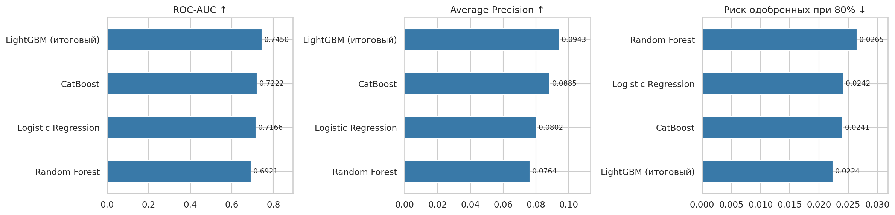
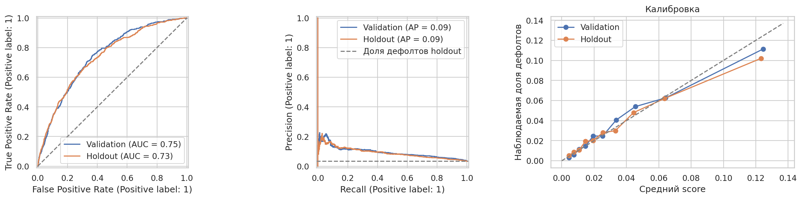

# Кредитный скоринг по кредитной истории

Проект прогнозирования дефолта по анонимизированной кредитной истории из соревнования [Alfa-Bank PD Credit History](https://www.kaggle.com/competitions/alfa-bank-pd-credit-history/data). Единица наблюдения — заявка; кредитные продукты агрегируются в признаки заявки. Используется порядок ID как порядок подачи заявок, без восстановления календарных дат.

## Итоговый результат

| Метрика | Validation | Holdout |
|---|---:|---:|
| ROC-AUC | 0,7450 | 0,7344 |
| Average Precision | 0,0943 | 0,0896 |
| Доля одобрений | 80,00% | 80,65% |
| Доля событий среди одобренных | 2,24% | 2,15% |
| Доля событий среди отклонённых от всех событий | 49,25% | 48,10% |

На holdout среди отклонённых оказались 241 из 501 событий и 2662 клиента без события. Относительное снижение частота `flag=1` среди одобренных составила около 36%: 2,15% против 3,34% во всей выборке. Порог 0,053229853722525304 выбран на validation до открытия holdout.




## Что сделано

- Анализ структуры данных, кодов категорий, пропусков и истории кредитных продуктов.
- Признаки объёма и разнообразия истории, частот кодов, флагов, последнего продукта и последних 3/5 продуктов. Случайные числовые метки категорий не трактуются как суммы или тяжесть события.
- Сравнение Logistic Regression, Random Forest, CatBoost и LightGBM; увеличение train, поиск конфигураций и проверка весов классов.
- Итоговый LightGBM на 2 099 991 заявке, 600 итераций, около 13,6 минуты обучения в исходном окружении. Сохранены нативные деревья, схема и код применения.
- Зафиксированная проверка holdout и bootstrap-интервалы. AUC 95%: примерно 0,7173–0,7575.

## Быстрый запуск без исходного датасета

Рекомендуется Python 3.12. Распакуй ZIP или клонируй репозиторий вместе с разрешёнными файлами data/evaluation. Из папки проекта:

```bash
python -m venv .venv
```

Windows PowerShell:

```powershell
.\.venv\Scripts\Activate.ps1
```

Linux/macOS:

```bash
source .venv/bin/activate
```

Затем:

```bash
python -m pip install -r requirements.txt
python scripts/verify_model.py
jupyter lab
```

Открой notebooks/credit_scoring.ipynb и выполни все ячейки. RUN_RAW_ANALYSIS=False: ранняя подготовка пропускается; загружаются готовый LightGBM, validation-признаки и holdout-прогнозы. На validation прогноз Booster пересчитывается и сверяется с экспортом. Другие семейства оцениваются по сохранённым прогнозам на тех же ID и метках. Holdout по умолчанию воспроизводит уже выполненную проверку, а не новое независимое испытание.

Новые отчёты записываются в reports/generated; модель и исходные файлы оценки не перезаписываются.

## Подготовка и обучение

Инструкция скачивания — [data/README.md](data/README.md). Для EDA и базовой подготовки включи RUN_RAW_ANALYSIS=True в основном блокноте. Код подготовки сохранён, пути стали относительными. Его экспорт обновляет data/prepared.

Для нового обучения открой notebooks/train_lightgbm.ipynb и явно включи TRAIN_NEW_MODEL=True. Нужны исходные Parquet-части и базовые таблицы. Обработка большого train требует памяти и свободного диска; 13,6 минуты — историческое время fit, не время всей подготовки и не гарантия для другого компьютера. Новый запуск пишется в experiments, опубликованные веса остаются прежними. Без сырых данных полное обучение при упаковке не запускалось.

## Структура

| Папка / файл | Назначение |
|---|---|
| notebooks/credit_scoring.ipynb | EDA, применение модели, метрики и сравнение |
| notebooks/train_lightgbm.ipynb | Отдельное воспроизведение обучения |
| src/feature_builder.py | Точный экспорт финального построителя |
| src/inference.py | Загрузка весов и кодирование по сохранённой схеме |
| models/lightgbm/ | Деревья, схема, словарь и metadata |
| data/evaluation/ | Небольшие файлы оценки и baseline-прогнозы |
| data/prepared/ | Базовые таблицы, исключены из Git |
| data/raw/ | Самостоятельно скачанный архив, исключён из Git |
| reports/ | Опубликованные метрики и графики |
| scripts/verify_model.py | Проверка восстановления Booster |
